# 개발 환경 구축

[01] 플러터 SDK 내려받기
---

### 1. [플러터]() 접속 후 운영체제 및 앱 타입 선택

  - windows, Android 선택

<br>

### 2. 'Install the Flutter SDK'에 있는 [flutter_windows_{버전}.zip] 클릭

<br>

### 3. 내려받은 압축 파일을 원하는 위치에 풀기

<br>

|따라하기|
|-|
|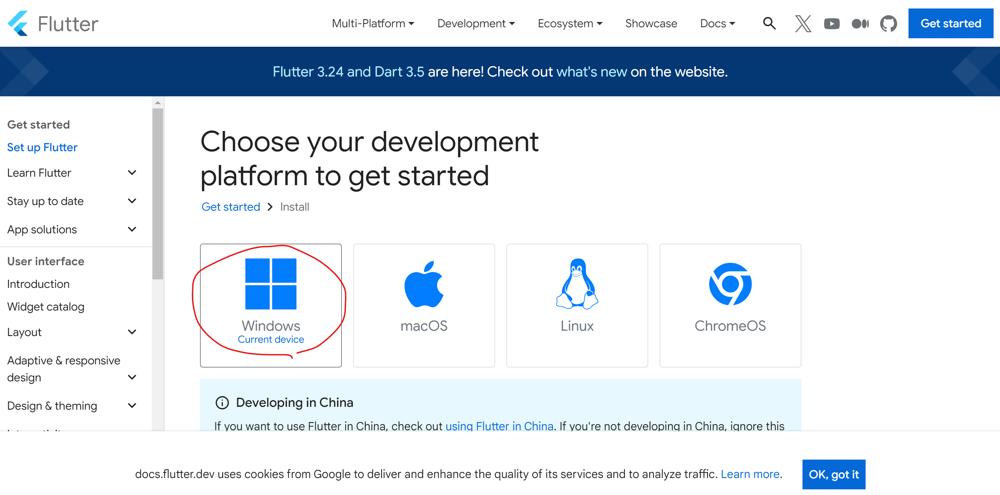|
|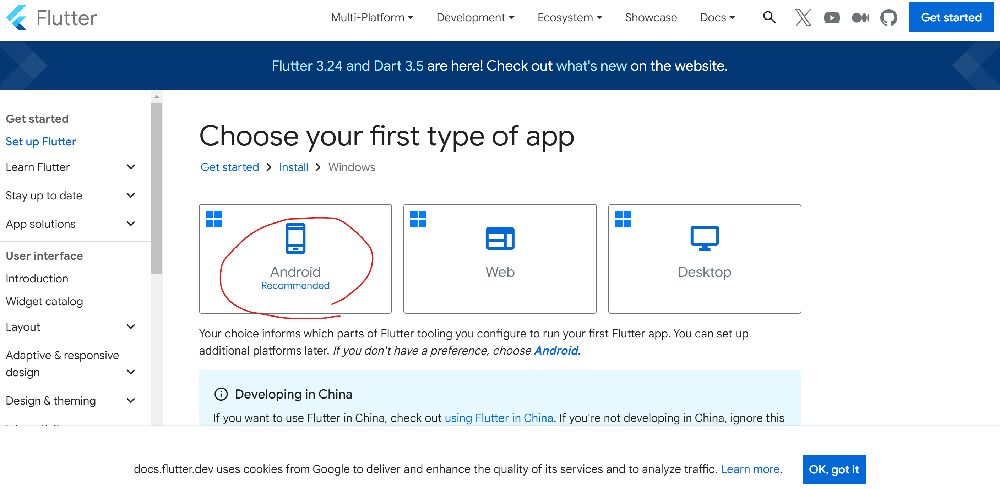|
|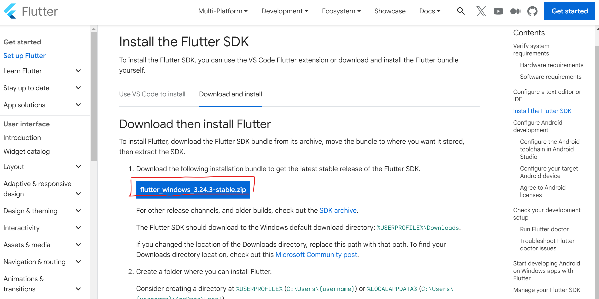|

<br>

---

<br>

[02] 환경 변수 설정
---

> 환경 변수 설정
```
  플러터 SDK를 사용해 모든 플러터 명령을 실행하기 위해 윈도우에 플러터 SDK 위치 등록
```

### 1. 윈도우 검색창에 '환경' 검색 → '시스템 환경 변수 편집' 클릭

<br>

### 2. [환경 변수(N)] 선택

<br>

### 3. 첫번째 변수 박스 내에 'Path' 변수 존재여부 확인

- Path 변수 O

  - Path 변수 선택 → [편집(E)] → 팝업창에서 [찾아보기(B)] → 압축 푼 [flutter] 폴더 내 [bin] 폴더 선택 → 확인

- Path 변수 X → Path 변수 새로 생성

  - [새로 만들기(W)] → 팝업창에서 변수 이름으로 Path 입력 → [디렉터리 찾아보기(D)] → 압축 푼 [flutter] 폴더 내 [bin] 폴더 선택 → 확인

<br>

|따라하기|
|-|
|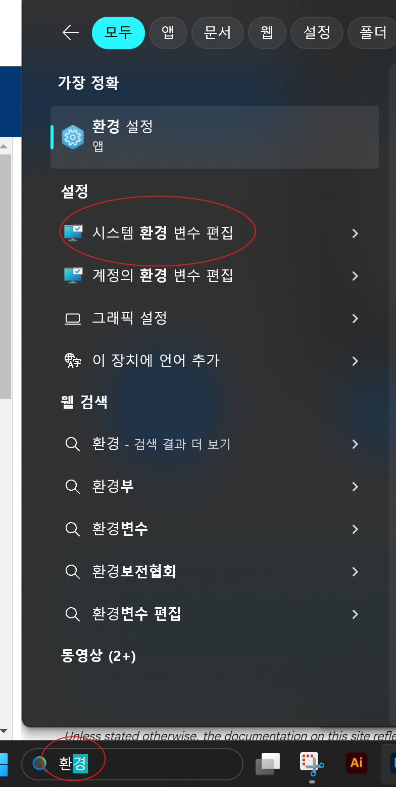|
|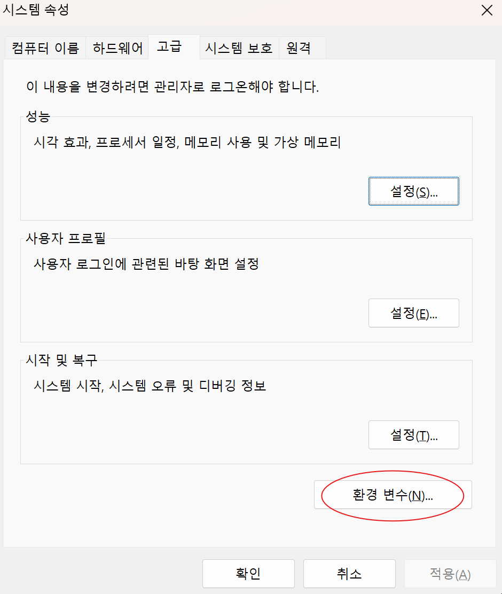|
|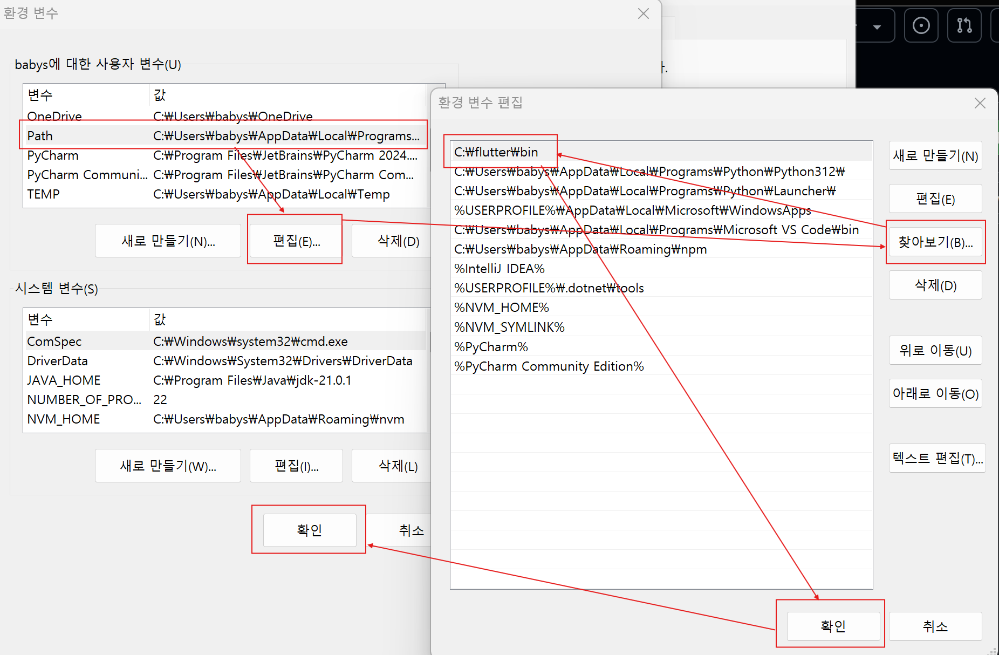|
|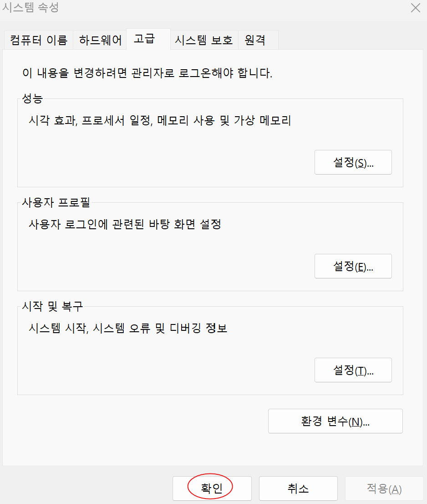|

<br>

---

<br>

[03] 안드로이드 스튜디오 설치
---
> 안드로이드 스튜디오
```
  플러터를 개발하는 IDE(통합 개발 환경)
  설치 과정은 운영체제와 상관없이 같음
```

### 1. [안드로이드 스튜디오](https://developer.android.com/studio) 접속

<br>

### 2. 다운로드 후 설치 파일 실행해서 기본값으로 설치

<br>

|따라하기|
|-|
|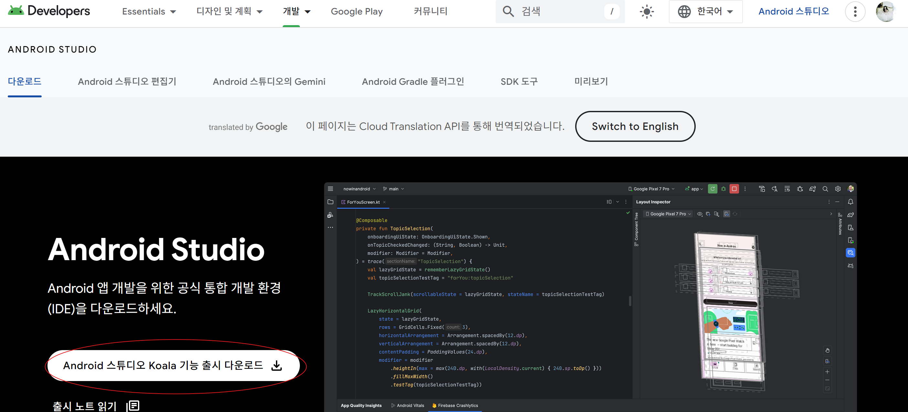|
|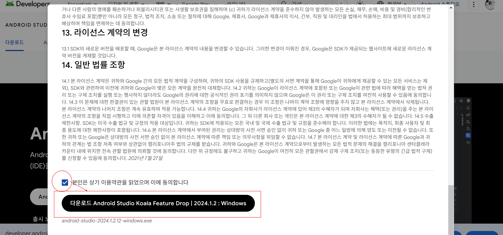|

<br>

---

<br>

[04] 다트/플러터 플러그인 설치
---
### 1. 안드로이드 스튜디오 실행 후 기본화면 나오는지 확인
- 만약 프로젝트가 바로 실행된다면 모든 프로젝트 닫기

<br>

### 2. 왼쪽 [Plugins] → [Marketplace] 탭 → 검색창에 Flutter 검색 → [Install]

<br>

### 3. 설치 후 [Restart IDE]
- 재실행해야 플러그인 반영됨

<br>

|따라하기|
|-|
|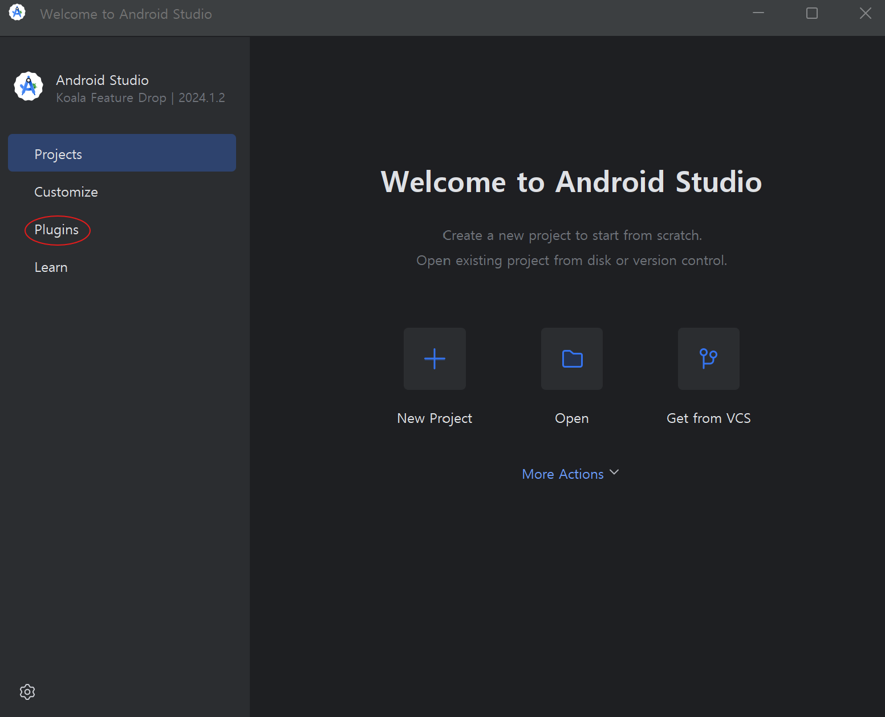|
|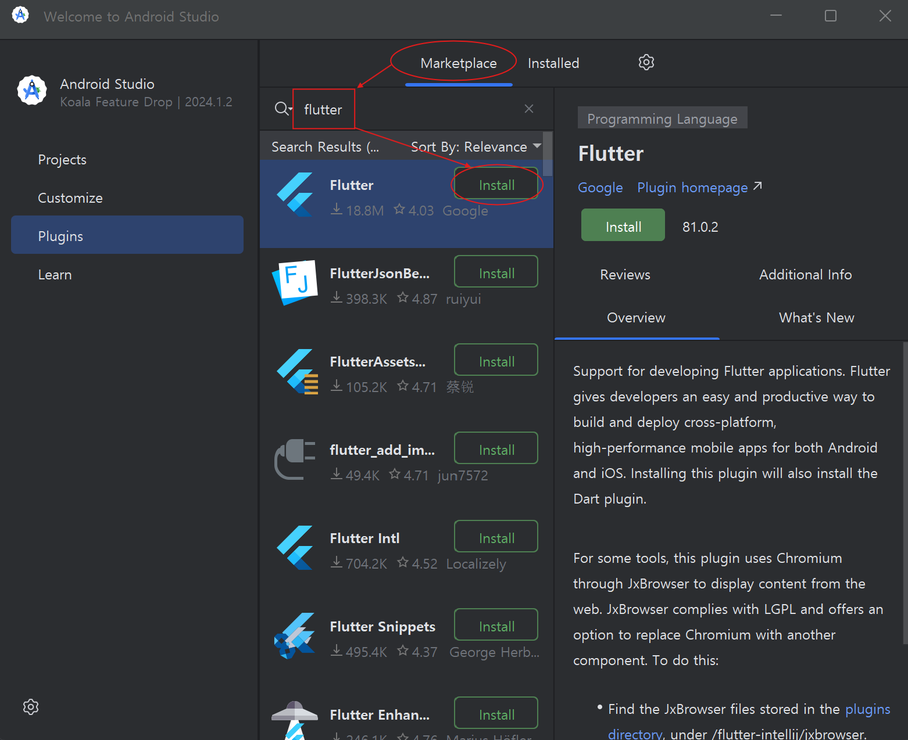|
|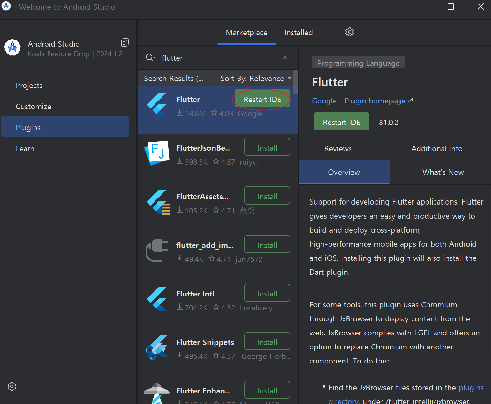|

<br>

---

<br>

[05] 설치 문제 해결
---
> 플러터 닥터(flutter doctor)
```
  구글에서 제공
  문제를 어떻게 해결해야 하는지 개발자에게 알려주는 도구
```

### 1. 플러터 닥터로 문제 확인
- 터미널 → 'flutter doctor' + enter

  - Flutter, Android toolchain 이 초록색 체크 박스여야 함

> 문제 확인 결과
```bash
  Doctor summary (to see all details, run flutter doctor -v):
  [✓] Flutter (Channel stable, 3.24.3, on Microsoft Windows [Version 10.0.22631.4169], locale ko-KR)
  [✓] Windows Version (Installed version of Windows is version 10 or higher)
  [!] Android toolchain - develop for Android devices (Android SDK version 35.0.0)
      ✗ cmdline-tools component is missing
        Run `path/to/sdkmanager --install "cmdline-tools;latest"`
        See https://developer.android.com/studio/command-line for more details.
      ✗ Android license status unknown.
        Run `flutter doctor --android-licenses` to accept the SDK licenses.
        See https://flutter.dev/to/windows-android-setup for more details.
  [✓] Chrome - develop for the web
  [✓] Visual Studio - develop Windows apps (Visual Studio Enterprise 2022 17.9.2)
  [✓] Android Studio (version 2024.1)
  [✓] IntelliJ IDEA Community Edition (version 2024.1)
  [✓] IntelliJ IDEA Ultimate Edition (version 2023.3)
  [✓] VS Code (version 1.93.1)
  [✓] Connected device (3 available)
  [✓] Network resources
```

<br>

### 2. 'cmdline-tools component is missing' 문제 해결
- 원인

  - Android SDK Command Line Tools 가 설치되지 않아 발생
 
- 해결

  - Android Studio 실행 → [Customize] → [All settings]

<br>

### 3. 'Android license status unknown' 문제 해결
- 원인

  - 안드로이드 스튜디오를 사용하려면 라이선스 동의를 해야하는데 동의하지 않아 발생
 
- 해결

  - 터미널에서 'flutter doctor --android-licenses' 명령 실행
 
  - 이후 모든 물음에 'y' 입력

> 터미널
```
  flutter doctor --android-licenses
```

<br>

|따라하기|
|-|
|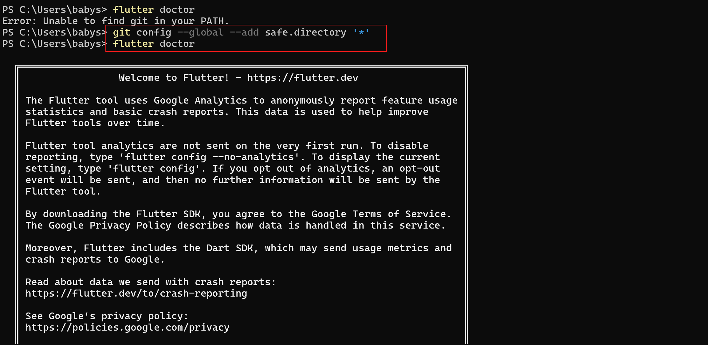|
|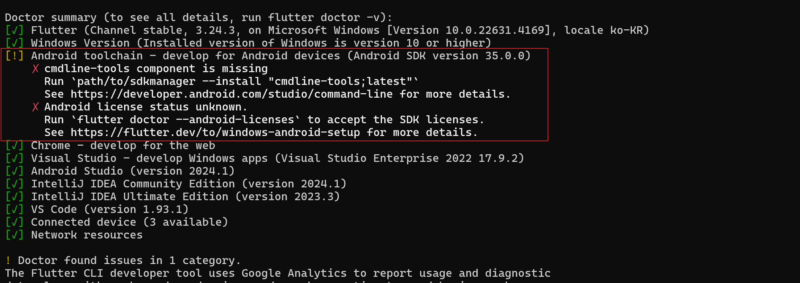|
|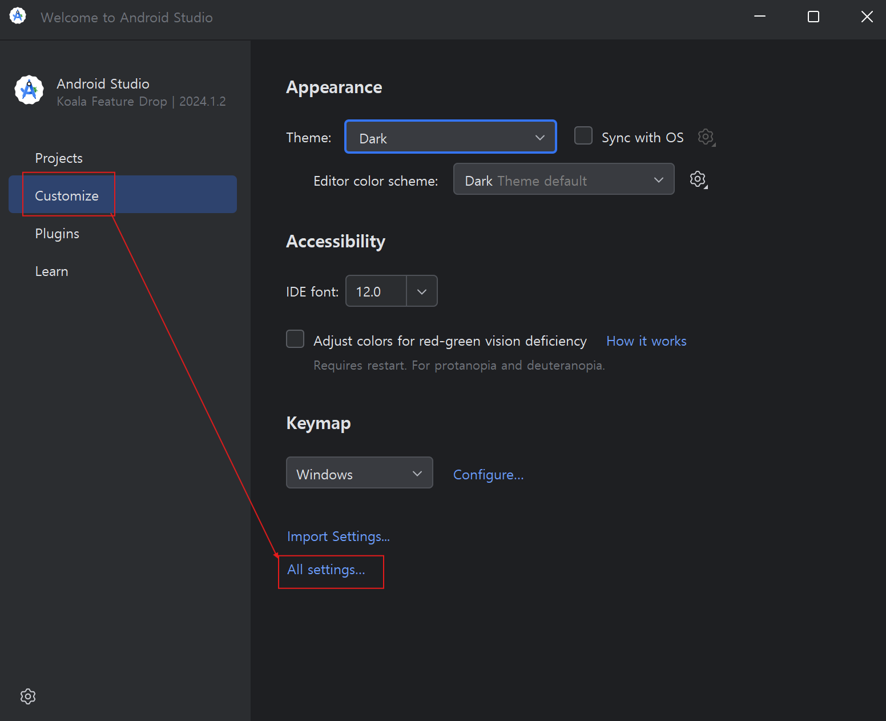|
|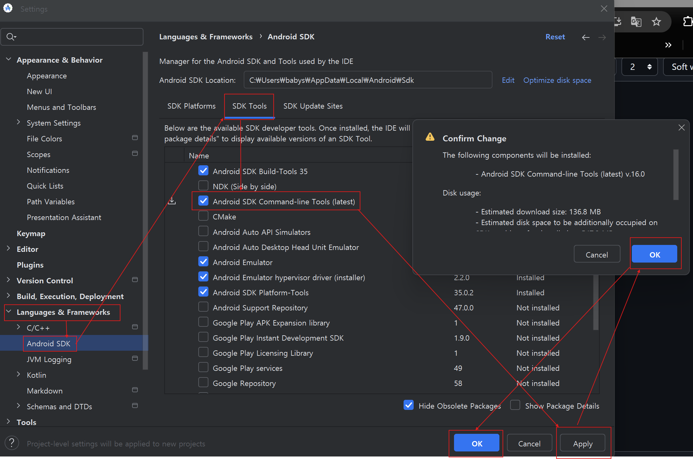|
|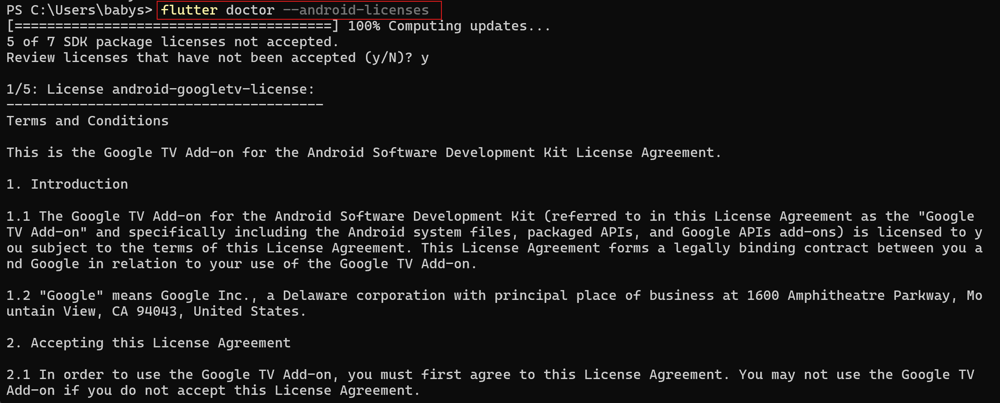|
|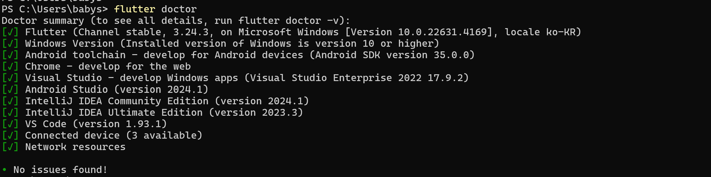|

<br>

#### 💡 터미널에서 'flutter doctor' 입력했더니 Error: Unable to find git in your PATH. 발생
- Path 에 Git 경로 설정이 잘 되어있으나, 위 에러 발생

  - 해결 방법
 
    - Git의 안전한 디렉토리 목록에 모든 디렉토리를 추가

> 터미널
```
  git config --global --add safe.directory '*'
```
- 이 설정을 사용하면 Git이 모든 디렉토리를 안전한 디렉토리로 간주
    
  - git config : Git의 설정을 변경하는 명령어
    
  - --global : 이 설정을 사용자의 모든 Git 프로젝트에 적용(현재 사용자에 대한 전역 설정)
  
  - --add : 특정 설정을 추가 ⇒ 같은 키에 대해 여러 값 설정 가능
  
  - safe.directory : Git이 안전하다고 간주하는 디렉토리 목록을 지정
  
    - 이 디렉토리에 대해 Git은 특정 작업(예: 푸시, 풀 등)을 허용
      
  - '*': 모든 디렉토리를 의미

<br>

